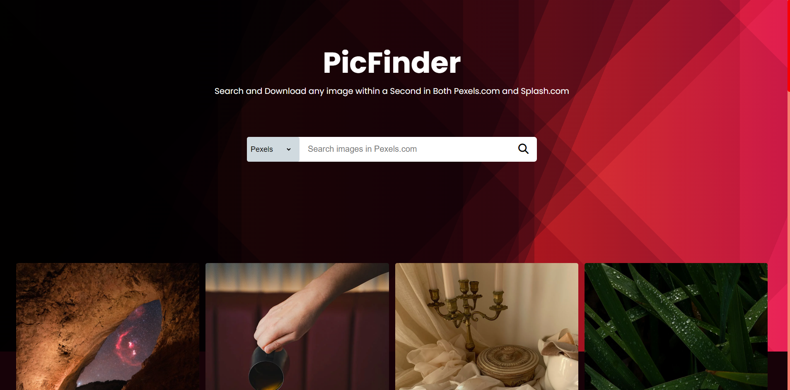

# PicFinder - An Image Search Engine



<br>


PicFinder is a functional image gallery project built using HTML, CSS, and JavaScript. It allows users to quickly search, view, and download images from the Pexels API, all within seconds. It serves as a clone of Pexels, providing a user-friendly interface for browsing and accessing a vast collection of high-quality images.

## Features

- **Search**: Users can search for images using keywords, allowing them to find relevant images quickly.
  
- **View**: The gallery displays thumbnails of the images fetched from the Pexels API. Clicking on a thumbnail opens a larger preview of the image.
  
- **Download**: Users can download images directly from the gallery with ease, enabling them to save their favorite images effortlessly.

- **Responsive Design**: The gallery is fully responsive and works seamlessly on different devices and screen sizes.

## Technologies Used

- **HTML**: Used for structuring the web pages and creating the layout of the gallery.
  
- **CSS**: Employed for styling the gallery, providing a visually appealing interface for users.
  
- **JavaScript**: Used to implement the functionality of the gallery, including fetching images from the Pexels API, handling user interactions, and more.
  
- **Pexels API**: PicFinder utilizes the Pexels API to fetch high-quality, royalty-free images.

## How to Use

To use PicFinder, follow these steps:

1. Clone the repository to your local machine.
    ```bash
    git clone https://github.com/Shaw145/PicFinder.git
    ```
  
2. Open the `index.html` file in your web browser.
  
3. Use the search bar to enter keywords and find images of interest.
  
4. Browse through the images displayed in the gallery.
  
5. Click on an image to view it in full size.
  
6. Optionally, click the download button to download the image.


## Usage
1. Upon opening the PicFinder gallery, you will be presented with a search bar and a gallery of images fetched from the Pexels API.

2. Type a keyword or phrase in the search bar and press Enter to search for images related to your query.

3. The gallery will update and display the relevant images.

4. Click on a thumbnail to open a larger preview of the image.

5. To download the full-resolution image, click the "Download" button in the image preview.

## Author
 - **Suman Shaw**

## Resource
- [**CodingNepal**](https://www.youtube.com/@CodingNepal)